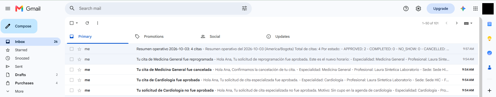
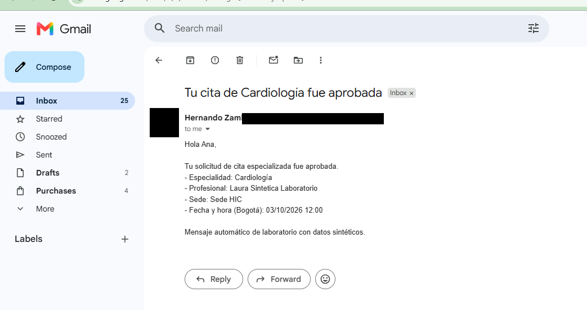
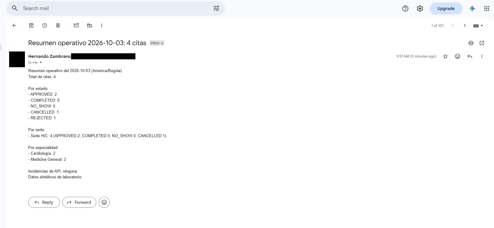

# S5/S6 — Ejecución real de WF-001, WF-002 y WF-003

Fecha: 2026-10-03. Instancia: `impulso-n8n.aiacademy.com.co`. API local en Docker (`citas-api-dev`, BD `citas_app` en v9) expuesta por ngrok en Docker con la política `automations/ngrok/traffic-policy.yml`. Datos sintéticos (`@example.test`); todos los correos van al buzón de laboratorio configurado en n8n (`testRecipient`/`recipient`), nunca a los pacientes.

## Configuración verificada

| Elemento | Verificación |
|---|---|
| Variables del contenedor | `AUTOMATION_API_KEY` y `N8N_STATUS_WEBHOOK_SECRET` de 40 caracteres (valores no mostrados), `DB_NAME=citas_app` |
| Túnel ngrok (desde Internet) | `/actuator/health`, `/api/v1/auth/login`, `/api/v1/appointments/mine` → **404** (bloqueadas en el borde); `/api/v1/automation/reminders/due` sin clave → **401**; con clave → **200** |
| Credenciales en n8n | `Hernando X-Automation-Key`, `Hernando webhook secret` (Header Auth) y `Hernando Gmail` (OAuth2), creadas por el estudiante y asignadas por id; ninguna credencial ajena |
| Webhook WF-002 | Sin secreto → **403**; con secreto y payload inválido → **400** `{"error":"invalid_payload"}` |

## WF-001 — recordatorios (`Hernando-WF-001-appointment-reminders`)

| Ejecución | Escenario | Resultado |
|---|---|---|
| 76 | Primera ejecución real | Gmail respondió 403 (Gmail API/permisos aún no listos); la rama de error registró **FAILED** intento 1 en la API |
| 77 | Tras corregir Gmail | Correo enviado (`providerMessageId 1a1023f55f3b8607`); la API registró **SENT** intento 2 |
| 78 | Repetición inmediata | La API devolvió `items: []`; Gmail **no** se ejecutó (idempotencia) |
| 79 | API detenida | 3 reintentos, 502 de ngrok, rama **"API no disponible"**; ningún correo |

El estudiante confirmó un único recordatorio en el buzón.

## WF-002 — cambios de estado (`Hernando-WF-002-status-notifications`, activo)

Eventos generados desde la API (decisiones ADMIN y cancelación del paciente) y despachados por el outbox V9:

| Evento | Outbox | Correo recibido |
|---|---|---|
| `SPECIALIZED_DECISION` / REJECTED (motivo "Sin cupo en la agenda de cardiologia") | DELIVERED, intento 1, HTTP 200 | "Tu solicitud de Cardiología no fue aprobada" |
| `CANCELLATION` / CANCELLED | DELIVERED, intento 1, HTTP 200 | "Tu cita de Medicina General fue cancelada" |
| `SPECIALIZED_DECISION` / APPROVED | DELIVERED, intento 1, HTTP 200 | "Tu cita de Cardiología fue aprobada" |
| `RESCHEDULE_DECISION` / APPROVED | DELIVERED, intento 1, HTTP 200 | "Tu cita de Medicina General fue reprogramada" |

## WF-003 — resumen operativo (`Hernando-WF-003-daily-operational-summary`)

Ejecución 85: 4 citas del 2026-10-03 (Bogotá) → APPROVED 2, CANCELLED 1, REJECTED 1; Sede HIC 4; Cardiología 2, Medicina General 2; "Incidencias de API: ninguna". Correo "Resumen operativo 2026-10-03: 4 citas" recibido.

## Capturas (correo y foto del buzón tapados)

## Ajustes hechos durante la prueba

- Backend: el webhook con flujo inactivo responde 404; se cambió el despachador para reintentar 404/401/403 y dejar como definitivos solo 400/422 (commit `77a8140`, suite 73/73).
- n8n: el detalle de error de WF-001 y del correo de incidencia de WF-003 se recorta a 200 caracteres (antes incluía la página HTML de ngrok).
- Compose: ngrok en Docker con `--log=stdout`.
